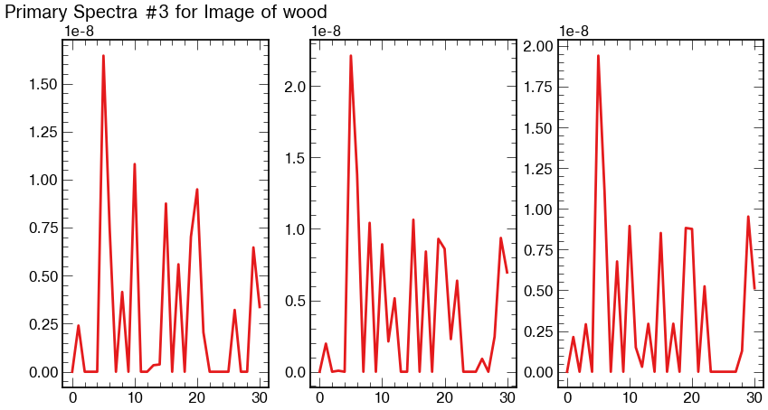

# Unsupervised Identification of Materials with Hyperspectral Images code
This repository was created to implement the code for the following student paper in the 36ths AAAI Conference on Artificial Intellegence:
https://ojs.aaai.org/index.php/AAAI/article/view/21708

This program was written in the Carnegie Mellon University Image Science Labs, and it was presented as part of the Undergraduate Consortium.

# How to replicate results
## Generate dataset
The contents of raw_data come from the Real-World Hyperspectral Images Database from Harvard University: http://vision.seas.harvard.edu/hyperspec/d2x5g3/

In order to process this data, the contents of the Harvard Real-World Hyperspectral Images Dataset was placed in a folder called `raw_data` and unzipped, and put in the same folder as the python files `generate_dataset.py`. Then, `generate_dataset.py` was run, creating two folders: `train` and `test`. I was hoping to store the results on github but the files were too big so they can be found here:

`burningsilicon.dev/datasets/test.tar.xz`
`burningsilicon.dev/datasets/train.tar.xz`
These are compressed using `xz` compression and can be decompressed using `xz -d -v`

## Generate dataset numpy files
Following this, the numpy files were created from the datasets using `generate_data_numpy_files.py`. You can use the numpy files on the github or you can run the python files to get the same result. Keep in mind that the dataset is quite large and you may need university level computing power to process it (ie. a supercomputer). So if you, like most people, don't have a supercomputer just lying around you can use the pre-processed numpy files: `test_images.npy` and `train_images.npy`. `test_images.npy` is small enough that it is on the github but `train_images.npy` can be found at `burningsilicon.dev/datasets/train_images.npy.xz` and unzipped using `xz -d -v train_images.npy.xz`

## Training Autoencoder
To train the autoencoder, run `train_autoencoder.py`. It is currently set to a batch size of 1 because the images take a long time to load but you could raise it if you have the space. That said, this particular model is extremely suceptable to not converging so be sure to lower the learning rate if you increase the batch size. The samed autoencoder model is the result of training the autoencoder on an adam optimizer with a learning rate of 0.00015, batch size of 1 and 50 epochs. You can train it yourself, or use the saved model. 

# Results
The autoencoder can be used to find the three primary spectra of an image - as you can see here, these are approximations of the spectra for an image containing mostly wood

It is highly optimized for recreating the spectra (as you can see in the high level of accuracy in the image below)

but less optimized for determining the distribution of the spectra (as you can see from the lower level of accuracy in the image below)

if you would like to recreate these plots you should run `demonstrate_autoencoder.ipynb`

# Future Research
This is still very early stage reserach. We need to determine if the three primary spectra actually resemble real spectra found in the image emperically, because at the moment this is mostly an interesting mathmatical exersize. In addition, further optimizations can likely be made with the neural network. It is uncertain as to why the network did not converge in nearly every batch size larger than 1, even when the learning rate was altered. 

When will these improvemts be made? When somebody funds future research! Please fund me! 🙏
